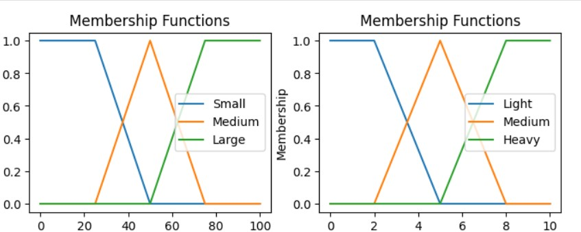
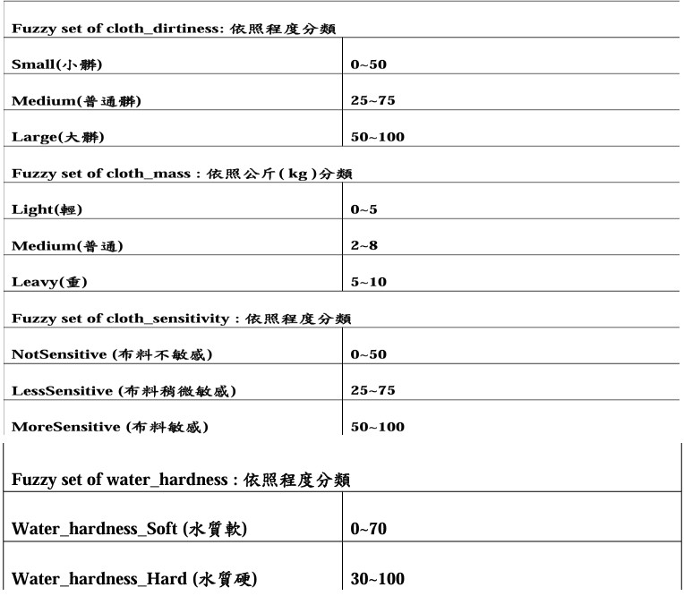
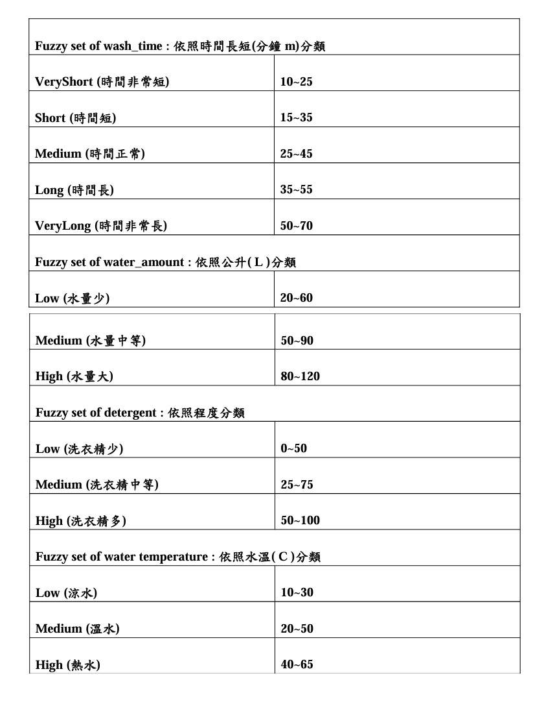
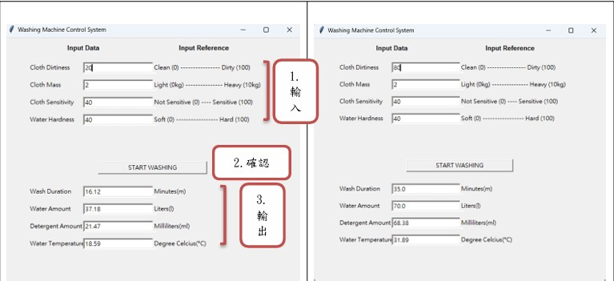

# fuzzy_wash_machine
以洗衣機為對象，設計一套模糊系統。
目的是在衣物投入後自動判斷各項參數並依此生成洗衣時長、水量、洗衣
劑用量、水溫，並依此自動洗衣達到智慧生活的目的，只需設定一個布料
敏感度參數即可不需要再設定其他的人工參數。
# 模糊系統介紹 
模糊系統的理論基礎是模糊子集(fuzzy subset)的概念，由美國自動控制專
家 Zadeh 於 1965 年提出，此後模糊系統理論得到發展。模糊系統(fuzzy 
system)，是一種將輸入、輸出和狀態變量透過歸屬函數( Membership 
function )、模糊、解模糊定義在模糊集上的系統。模糊系統從宏觀出發，
抓住了人腦思維的模糊性特點，在描述高階知識與行為方面發揮很好的效
用，可以模仿人的綜合推斷來處理常規數學方法難以解決的模糊信息處理
問題。
# membership function example

# Input Setting
將衣物髒污程度(cloth_dirtiness)、衣物多寡(cloth_mass)、布料敏感程度
(cloth_sensitivity)依照程度分成3類，水質軟硬(water_hardness)分成兩類。 

# Output Setting
將洗衣時間(wash_time) 分成五類、水量(water_amount)、洗衣劑用量
(detergent_amount)、水溫(water_temperature)依照程度分成3類。 

# UI DEMO

